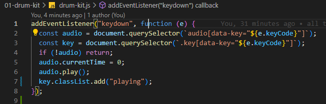
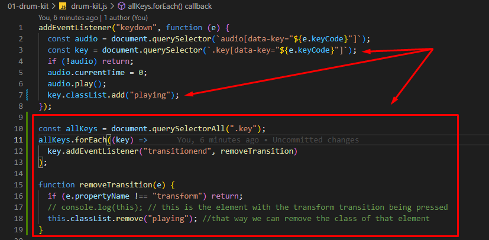

# Drum kit

## Make it sound: event listener; atribute selector


```JavaScript
addEventListener("keydown", function (e) {
// with this we can capture the number key of your keyboard
console.log(e.keyCode);
// we use the atribute selector insted of made a class with the only purpose of use it as a selector
const audio = document.querySelector(`audio[data-key="${e.keyCode}"]`)
// this stops the function withouth hiting troubbles if there isn't audio etiquet
if(!audio) return;
//this will restart the process if other key is push
audio.currentTime = 0; 
audio.play()
});
```

## Make it pretty: classlist add and remove; forEach; this;



/ select by class (.key) the ones with the atribute ...

`const key = document.querySelector(.key[data-key="${e.keyCode}"]);`
