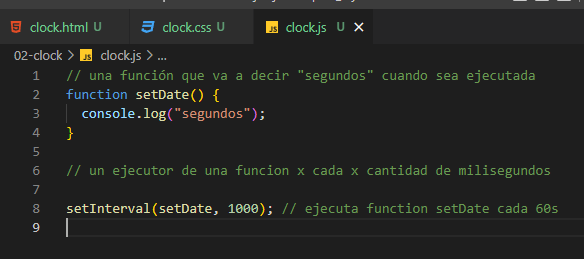

# Clock

## CSS:

### variables in CSS

```CSS
:root {
    --size_clock: 200px;
    --main_color: rgb(57, 55, 58);
}
```

### transition

```CSS
.hand {
    position: absolute;
    top: 50%;
    width: 50%;
    height: 7px;
    border-radius: 10%;
    background-color: var(--main_color);
    box-shadow: 0 0 .3rem #111110;
    transform: rotate(90deg);  /*(1) esto lo rota en su eje central. 90° lo pone en vertical en vez de horizontal*/
    transform-origin: 100%; /*(2) hace que el eje central de rotación este en el extremo en vez del medio (50%)*/
    transition: all 0.05s; /*hace el movimiento de las agujas fluido en vez de brusco*/
    transition-timing-function: cubic-bezier(0.1, 2.7, 0.58, 1);
}
```

## JS: date methods



